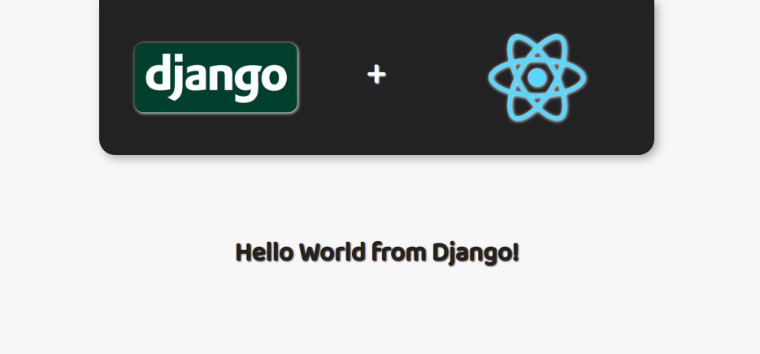

# django-react-example
Django (Backend) and ReactJS (Frontend) in the same app. Hello World example.

#### Scripts to run at backend folder:

- python -m venv venv
- . ./venv/bin/activate
- pip install -r requirements.txt
- python manage.py runserver

#### Scripts to run at frontend folder:

- yarn install
- yarn start

---

##### Sample:

